# 记录自己用NodeJS完成编写JVM的过程

项目完全参考张秀宏的《自己动手写Java虚拟机》代码结构，在此向本书作者表示感谢。

## 运行环境
NodeJS 版本：12.11.1  
WebStorm 版本：WebStorm 2018.2.3  
Java版本：1.8

## 代码结构
<pre>
images---------------------------------运行截图
java-----------------------------------java的代码与class文件
+----class-----------------------------java编译生成的class文件
+----code------------------------------java的测试代码
src------------------------------------jvm代码
+-----ch01-----------------------------对应书中第1章实现代码
+-----ch02-----------------------------对应书中第2章实现代码
+-----ch03-----------------------------对应书中第3章实现代码
+-----ch04-----------------------------对应书中第4章实现代码
+-----ch05-----------------------------对应书中第5章实现代码
+-----ch06-----------------------------对应书中第6章实现代码
+-----ch07-----------------------------对应书中第7章实现代码
+-----ch08-----------------------------对应书中第8章实现代码
+-----ch09-----------------------------对应书中第9章实现代码
+-----ch10-----------------------------对应书中第10章实现代码
+-----develop_code---------------------持续开发的实现代码
      +-----classfile------------------class文件解析的对象类
      +-----classpath------------------类路径目录
      +-----instructions---------------指令集
      +-----native---------------------本地方法目录
      +-----rtda-----------------------运行时数据区
</pre>

## 代码编写与运行结果
项目的所有运行都是采用直接运行main.js的方式，请读者运行时注意。

### 第1章-命令行工具
完成一个简易的命令行工具，使用各种参数执行JVM命令  
传入参数：
> --cp foo/bar MyApp arg1 arg2

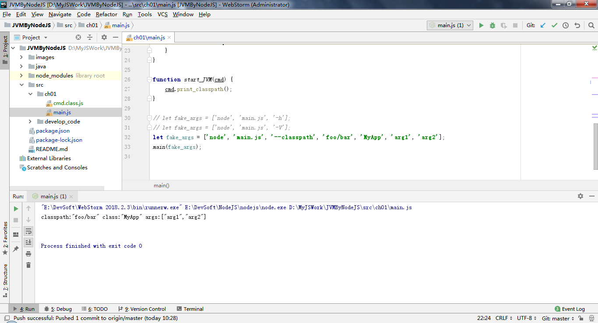
1. 采用program对命令进行解析。
2. 由于该program不能对"-cp"命令进行解析，故改成"-c"。

### 第2章-搜索class文件
完成搜索class文件功能，类路径的查找，按照搜索的先后顺序，类路径可以从以下3个部分查找：启动类路径、扩展类路径、用户类路径。
传入参数：
> --Xjre "D:\JavaTools\jdk1.8.0_151\jre" java.lang.Object

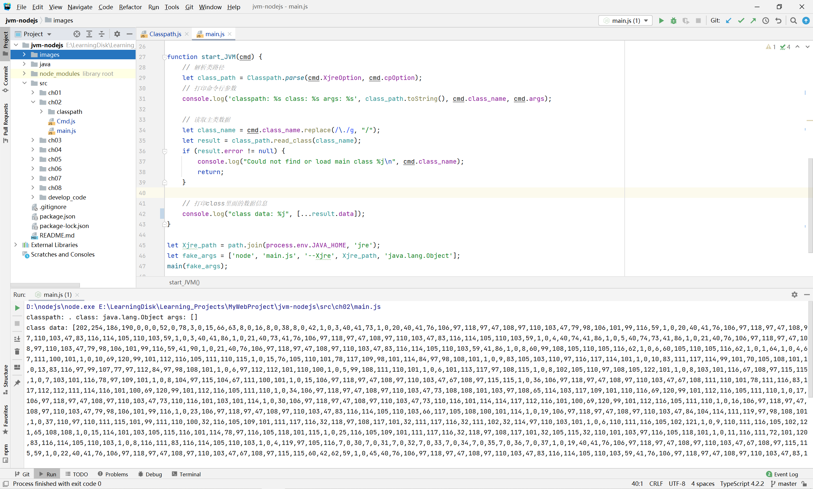
1. 由于node.js的异步机制，在遍历文件夹目录的时候，采用递归的做法，没有用walk模块。
2. node.js和java很像，不能像python返回多个参数，笔者采用了返回map对象，代替多个返回值的实现。

### 第3章-解析class文件
完成解析class文件功能，将class文件加载之后，按照JVM规范，读取字节，存储class的版本号，类属性、方法、接口的对象。  
传入参数：  
> --Xjre "D:\JavaTools\jdk1.8.0_151\jre" java.lang.String

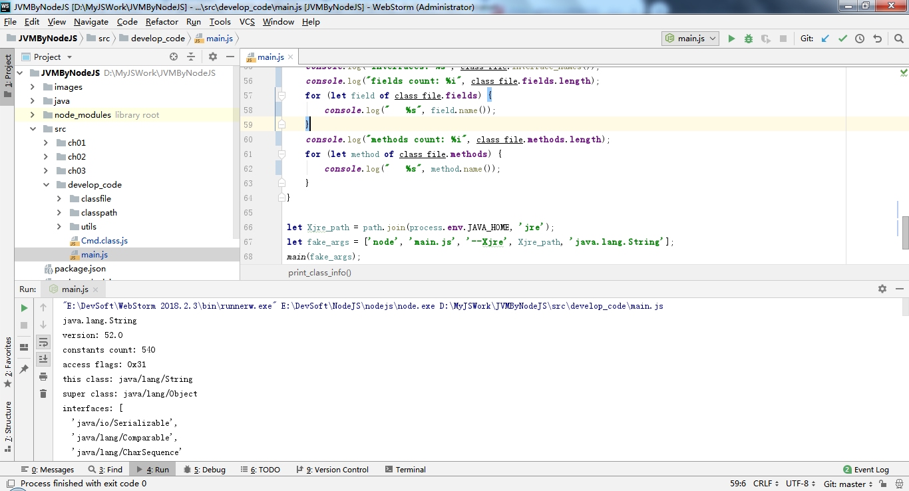
1. 数组快速初始化：  
    ```
    Array(cp_count).fill(null).map(() => 0);
    ```
2.  将bytes数组转成long长整型，node.js中长整型是BigInt类型：
    ```
    const view = new DataView(bufferUtils.toArrayBuffer(byte_data));
    this.val = view.getBigInt64(0);
    ```

### 第4章-运行时数据区
&emsp;&emsp;实现运行时数据区（run-time data area），可分为两类：一类是多线程共享的，另一类是线程私有的。多线程共享的运行时数据区需要在Java虚拟机启动时创建好，在Java虚拟机退出时销毁。线程私有的运行时数据区则在创建线程时才创建，线程退出时销毁。  
&emsp;&emsp;多现场共享的内存区域主要存放两类数据：类数据和类实例（也就是对象）。对象数据存放在堆中，类数据存放在方法区中。线程私有的运行时数据区用于辅助执行Java字节码。  
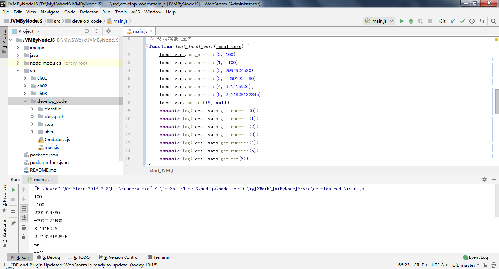
1. 不能使用以下代码初始化对象数组，需要用for循环遍历初始化对象，因为会陷入死循环（栈溢出）。
    ```
    Array(cp_count).fill(null).map(() => new Object());
    ```
2. 为了使用String.format，导入string-format包，使用方法如下：  
    ```
    let format = require('string-format');
    format.extend(String.prototype);
    let a = "size:{0} slots:{1}".format(this.size, this.slots.toString());
    console.log(a)
    ```

### 第5章-指令集和解释器
&emsp;&emsp;在前两章的基础上编写了一个简单的解释器，并实现大约150条指令，可以执行100个整数求和的程序，能得到5050的正确答案。  
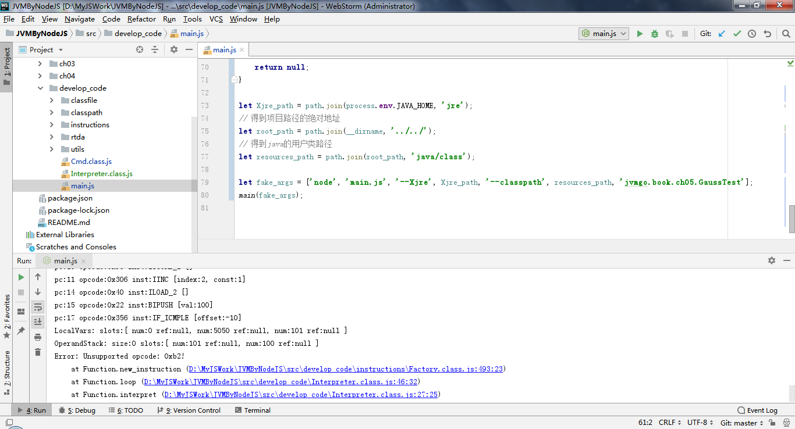
1. 获得类名可以使用以下代码
    ```
    obj_instance.constructor.name
    ```
2. 读取文件示例代码
    ```
    data = fs.readFileSync(file_name, function (err, bytesData) {
        if (err) {
            error = err;
        }
    });
    ```

### 第6章-类和对象
&emsp;&emsp;实现线程共享的运行时数据区，包括方法区、运行时常量池、类和对象、一个简单的类加载器，以及ldc和部分引用类指令。  
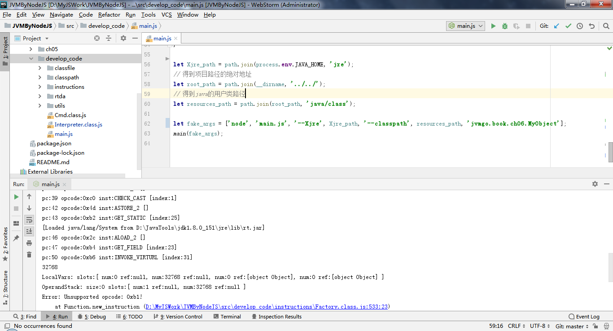

1. 运算优先级的问题
    ```
    0 != 9 & 0x0008
    ```
该代码在python、go语言下执行为true,但是在node.js中执行为0，因为在node.js中!=的优先级比&高。需要加括号，以调整运算优先级。

### 第7章-方法调用和返回
&emsp;&emsp;基本完成了方法调用和返回，并实现了类初始化逻辑，已经可以运行Fibonacci程序（求第30个Fibonacci数）。  
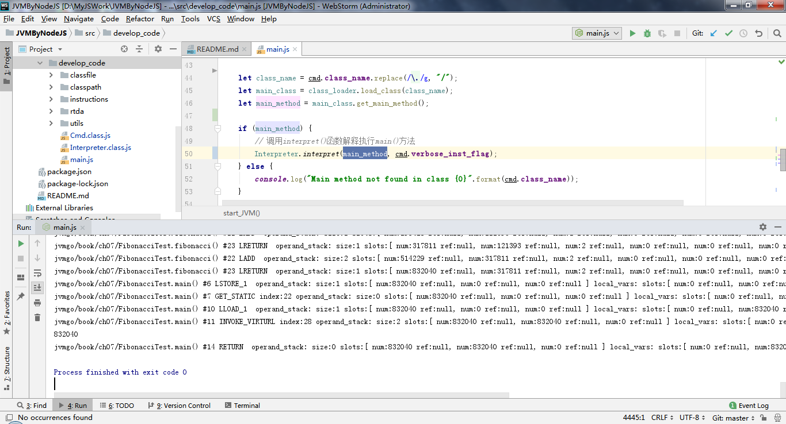
1. 该程序会执行很长的时间，但是最后会打印出832040结果。
2. 该程序可能会报“JavaScript heap out of memory”错误，可以在Node Parameters中添加“--max-old-space-size=8000”，表示内存地址8000MB大小。

### 第8章-数组和字符串
实现了数组和字符串的加载，终于可以运行HelloWorld程序了。
1. 解析并执行BubbleSortTest（冒泡排序）算法

2. 解析并执行HelloWorld程序，打印出Hello world!
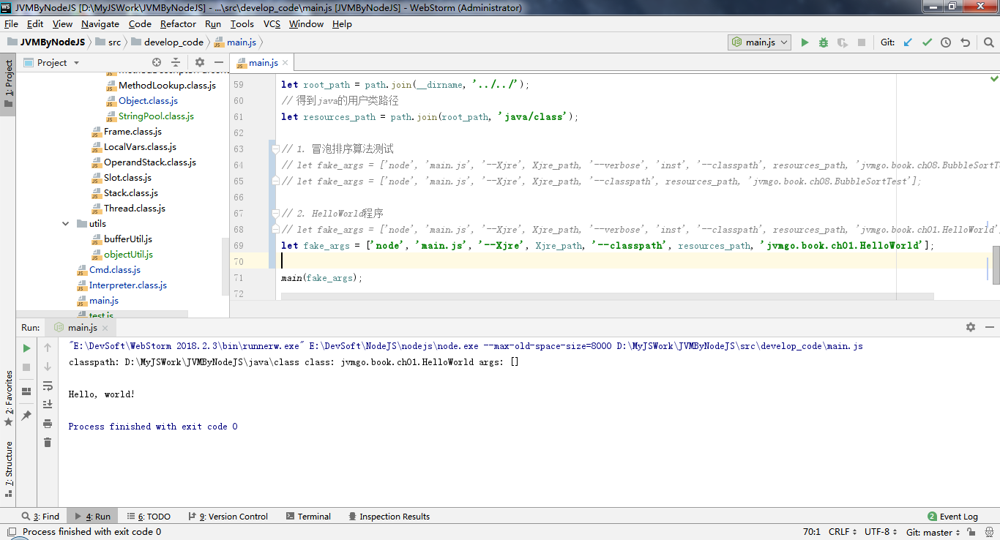
3. 解析并执行PrintArgs程序，打印出传入的参数
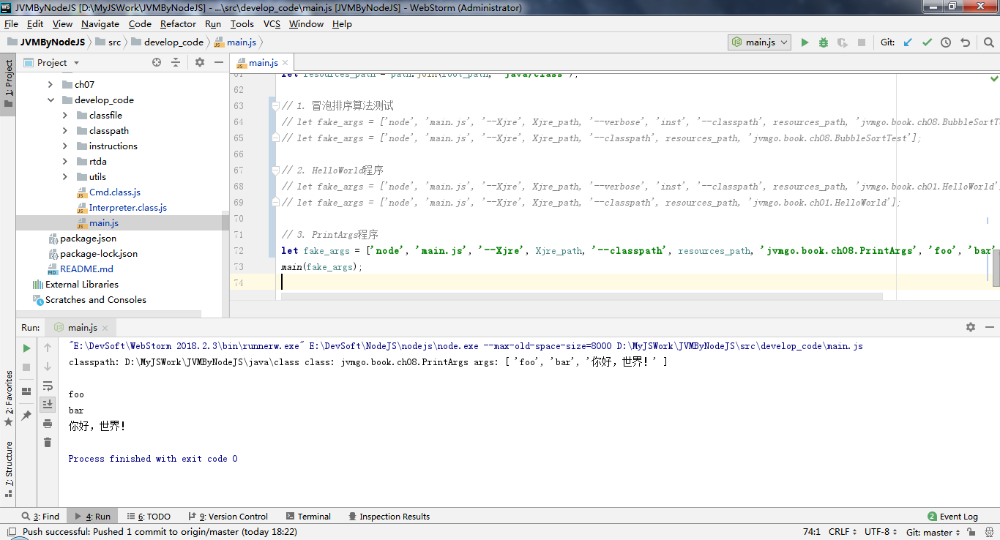

### 第9章-本地方法调用
实现了本地方法调用的指令，以及Java类库中一些最基本的类和本地方法，有如下本地方法：java.lang.Object.getClass()、java.lang.Class.getPrimitiveClass()、java.lang.Class.getName0()、java.lang.Class.desiredAssertionStatues0、System.arrayCopy()、Float.floatToRawIntBits()、Double.doubleToRawLongBits()  
1. 执行GetClassTest程序，得到基本数据类型的类getName()结果。
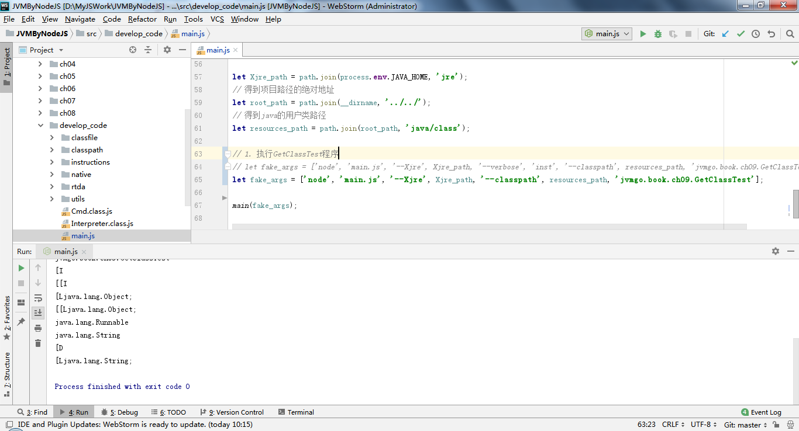
2. 执行StringTest程序，得到字符串判断的结果
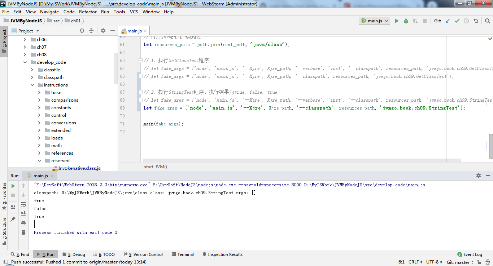
3. 执行ObjectTest程序，得到对象的hashCode值，生成hashCode的代码是直接利用内置函数hash()生成的
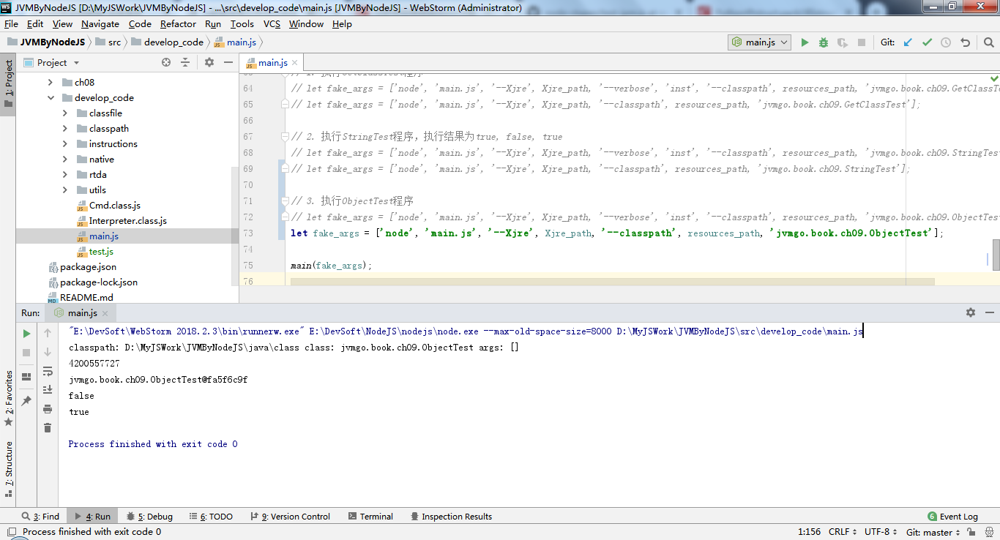
4. 执行CloneTest程序，可以观察到克隆的对象与原始对象的pi值不一样
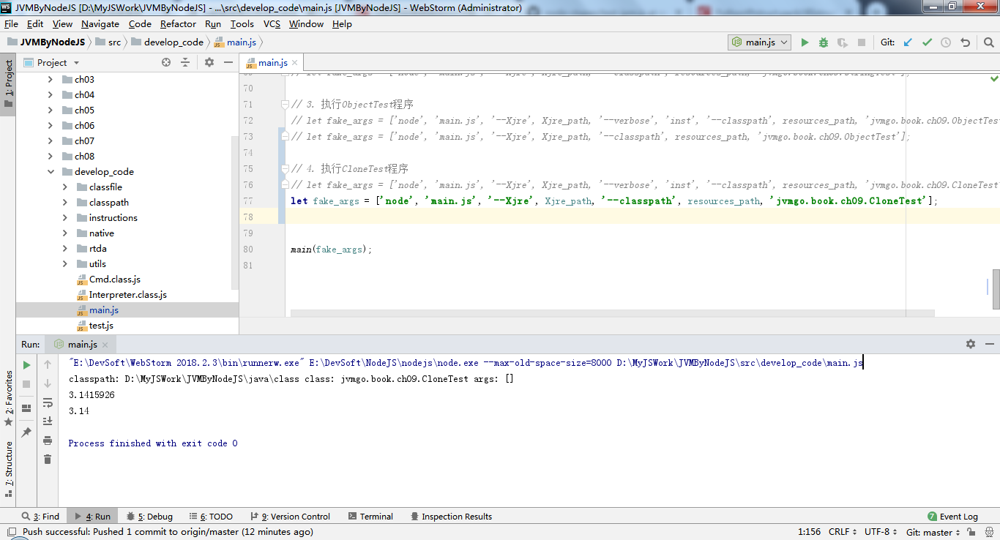
5. 执行BoxTest程序，可以打印出数组的元素


### 第10章-异常处理
实现了异常抛出和处理、异常处理表、athrow指令。在Java语言中，异常可以分为两类：Checked异常和Unchecked异常。Unchecked异常包括java.lang.RuntimeException、java.lang.Error以及它们的子类，其他异常都是Checked异常。所有异常都最终继承自java.lang.Throwable。如果一个方法有可能导致Checked异常抛出，则该方法要么需要捕获该异常并妥善处理，要么必须把该异常列在自己的throws子句中，否则无法通过编译。Unchecked异常没有这个限制。
1. 执行ParseIntTest程序，输出参数123

2. 执行ParseIntTest程序，输出参数abc

3. 执行ParseIntTest程序，无输出参数，会抛出异常信息


   