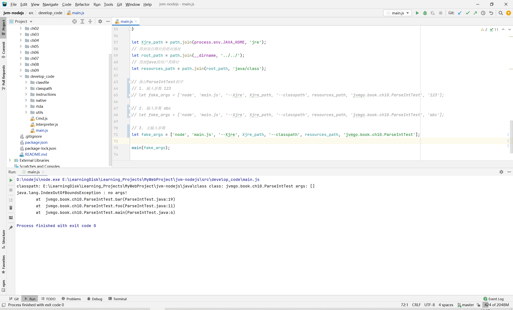

# JVM-NodeJS（用NodeJS实现Java虚拟机）

项目完全参考张秀宏的《自己动手写Java虚拟机》代码结构，原书使用Go语言实现，在此向本书作者表示感谢。

原书代码地址：https://github.com/zxh0/jvmgo-book

## 运行环境

NodeJS 版本：18.16.0
WebStorm 版本：WebStorm 2021.1
Java版本：1.8

## 项目结构
<pre>
images---------------------------------运行截图
java-----------------------------------java的代码与class文件
+----class---------------------------------java编译生成的class文件
+----code----------------------------------java的测试代码
src------------------------------------jvm代码
+-----ch01---------------------------------第1章命令行工具的实现代码
+-----ch02---------------------------------第2章搜索class文件的实现代码
+-----ch03---------------------------------第3章解析class文件的实现代码
+-----ch04---------------------------------第4章运行时数据区的实现代码
+-----ch05---------------------------------第5章指令集和解释器的实现代码
+-----ch06---------------------------------第6章类和对象的实现代码
+-----ch07---------------------------------第7章方法调用和返回的实现代码
+-----ch08---------------------------------第8章数组和字符串的实现代码
+-----ch09---------------------------------第9章本地方法调用的实现代码
+-----ch10---------------------------------第10章异常处理的实现代码
+-----develop_code---------------------持续开发的实现代码
      +-----classfile----------------------class文件解析的对象类
      +-----classpath----------------------类路径目录
      +-----instructions-------------------指令集
      +-----native-------------------------本地方法目录
      +-----rtda---------------------------运行时数据区
      +-----utils--------------------------工具类
      +-----Cmd.js-------------------------命令行类
      +-----Interpreter.js-----------------解释器
      +-----main.js------------------------主函数
tools----------------------------------解释器工具
</pre>

## 代码编写与运行结果

各章项目的测试都是将参数以数组的方式，传入到`main()`方法中，直接运行`main.js`即可。

### 第1章-命令行工具

完成一个简易的命令行工具，使用各种参数执行JVM命令。  

传入参数：
> --cp foo/bar MyApp arg1 arg2


1. 采用program对命令进行解析。

### 第2章-搜索class文件

完成搜索class文件功能，类路径的查找，按照搜索的先后顺序，类路径可以从以下3个部分查找：启动类路径、扩展类路径、用户类路径。

传入参数：
> --Xjre "D:\JavaTools\jdk1.8.0_151\jre" java.lang.Object


1. 由于Node.js的异步机制，在遍历文件夹目录的时候，采用递归的做法，没有用`walk`模块。
2. Node.js和Java很像，不能按照Python的方式返回多个参数，笔者采用了返回`Map`对象，代替多个返回值的实现。
3. 使用`adm-zip`包对ZIP文件进行解压缩。

### 第3章-解析class文件

完成解析class文件功能，将class文件加载之后，按照JVM规范：读取字节，存储class的版本号、类属性、方法、接口的对象。  

传入参数：  
> --Xjre "D:\JavaTools\jdk1.8.0_151\jre" java.lang.String


1. 数组快速初始化：  
    ```javascript
    Array(cp_count).fill(null).map(() => 0);
    ```
2.  将`bytes`数组转成`long`长整型，Node.js中长整型是`BigInt`类型：
    ```javascript
    const view = new DataView(bufferUtils.toArrayBuffer(byte_data));
    this.val = view.getBigInt64(0);
    ```

### 第4章-运行时数据区

&emsp;&emsp;实现运行时数据区（run-time data area），可分为两类：一类是多线程共享的，另一类是线程私有的。多线程共享的运行时数据区需要在Java虚拟机启动时创建好，在Java虚拟机退出时销毁。线程私有的运行时数据区则在创建线程时才创建，线程退出时销毁。  
&emsp;&emsp;多现场共享的内存区域主要存放两类数据：类数据和类实例（也就是对象）。对象数据存放在堆中，类数据存放在方法区中。线程私有的运行时数据区用于辅助执行Java字节码。  


1. 不能使用以下代码初始化对象数组，需要用`for`循环遍历初始化对象，因为会陷入死循环（栈溢出）。
    ```javascript
    Array(cp_count).fill(null).map(() => new Object());
    ```
2. 为了使用`String.format`，导入`string-format`包，使用方法如下：  
    ```javascript
    let format = require('string-format');
    format.extend(String.prototype);
    let a = "size:{0} slots:{1}".format(this.size, this.slots.toString());
    console.log(a)
    ```
3. 为了将Node.js中的`int`、`long`、`float`、`double`数据类型分开，添加`Numeric.js`文件，用`String`类型保留原始的数据类型，当需要获取时，再进行数据类型转换。

### 第5章-指令集和解释器

&emsp;&emsp;在前两章的基础上编写了一个简单的解释器，并实现大约150条指令，可以执行100个整数求和的程序，能得到5050的正确答案。  


1. 获得类名可以使用以下代码
    ```javascript
    obj_instance.constructor.name
    ```
2. 读取文件示例代码
    ```javascript
    data = fs.readFileSync(file_name, function (err, bytesData) {
        if (err) {
            error = err;
        }
    });
    ```

### 第6章-类和对象

&emsp;&emsp;实现线程共享的运行时数据区，包括方法区、运行时常量池、类和对象、一个简单的类加载器，以及`ldc`和部分引用类指令。  


1. 运算优先级的问题
    ```
    0 != 9 & 0x0008
    ```
该代码在Python、Go语言下执行为`true`，但是在Node.js中执行为0，因为在Node.js中`!=`的优先级比`&`高。需要加括号，以调整运算优先级。

### 第7章-方法调用和返回

&emsp;&emsp;基本完成了方法调用和返回，并实现了类初始化逻辑，已经可以运行Fibonacci程序（求第30个Fibonacci数）。  


1. 该程序会执行很长的时间，但是最后会打印出832040结果。
2. 该程序可能会报`JavaScript heap out of memory`错误，可以在`Node Parameters`中添加`--max-old-space-size=8000`，表示内存地址8000MB大小。

### 第8章-数组和字符串

实现了数组和字符串的加载，终于可以运行HelloWorld程序了。

1. 解析并执行BubbleSortTest（冒泡排序）算法


2. 解析并执行HelloWorld程序，打印出Hello world!


3. 解析并执行PrintArgs程序，打印出传入的参数


**本章总结：** 
1. 实现了对象深拷贝方法，在`utils/objectUtil.js`中的`deepcopy`方法。
2. Node.js的Map遍历的方法如下（其中PrimitiveTypes是Map类型）：
    ```javascript
    for(let [class_name, d] of PrimitiveTypes) {
            if (d === descriptor) {
                return class_name;
            }
        }
    ```

### 第9章-本地方法调用

实现了本地方法调用的指令，以及Java类库中一些最基本的类和本地方法，有如下本地方法：
- java.lang.Object.getClass()
- java.lang.Object.hashCode
- java.lang.Object.clone
- java.lang.Class.getPrimitiveClass()
- java.lang.Class.getName0()
- java.lang.Class.desiredAssertionStatues0
- java.lang.String.intern()
- java.lang.System.arraycopy()
- java.lang.Float.floatToRawIntBits()
- java.lang.Float.intBitsToFloat
- java.lang.Double.doubleToRawLongBits()  
- java.lang.Double.longBitsToDouble()
- sun.misc.VM.initialize()

1. 执行GetClassTest程序，得到基本数据类型的类getName()结果。


2. 执行StringTest程序，得到字符串判断的结果


3. 执行ObjectTest程序，得到对象的hashCode值，生成hashCode的代码是直接利用内置函数hash()生成的


4. 执行CloneTest程序，可以观察到克隆的对象与原始对象的pi值不一样


5. 执行BoxTest程序，可以看到打印的数组值


**本章总结：** 
1. 由于`invokenative`指令是动态执行本地方法，又因为本地方法在不同的模块里，因此自己实现了动态加载模块，并执行对应的函数方法。  
    ```javascript
    for (let load_module of LOAD_MODULES){
        // 加载该模块，判断里面是否有native_method方法
        let md = require(load_module);
        if(Object.getOwnPropertyDescriptors(md).hasOwnProperty(native_method.name)) {
            let func = Object.getOwnPropertyDescriptors(md)[native_method.name].value;
            func.call(func, frame);
            return;
        }
    }
    ```
2. 在生成hash code时，采用`fnv-plus`包，具体代码如下：
    ```javascript
    const fnv = require('fnv-plus');
    let hash_value = fnv.hash(this_ref.toString(), 32).dec();
    ```
3. 在加载java/util/Hashtable类时，由于解析Class文件，初始化ConstantPool的时候，node.js赋值float型的数据不能保留原始数据类型，导致程序运行失败，具体错误如下：
    ```shell
    LocalVars: slots:[ num:0 ref:[object Object], num:0 ref:[object Object], num:0 ref:null, num:0 ref:null ]
    OperandStack: size:1 slots:[ num:0 ref:[object Object], num:1 ref:[object Object] ]
    RangeError [ERR_OUT_OF_RANGE]: The value of "value" is out of range. It must be >= -2147483648 and <= 2147483647. Received 2147483648
        at checkInt (internal/buffer.js:58:11)
        at writeU_Int32BE (internal/buffer.js:788:3)
        at Buffer.writeInt32BE (internal/buffer.js:876:10)
        at PACK_INT32_BE (D:\MyJSWork\JVMByNodeJS\node_modules\python-struct\src\core.js:90:51)
        at Function.pack (D:\MyJSWork\JVMByNodeJS\node_modules\python-struct\src\core.js:602:25)
        at LocalVars.get_float (D:\MyJSWork\JVMByNodeJS\src\develop_code\rtda\LocalVars.js:41:43)
        at _fload (D:\MyJSWork\JVMByNodeJS\src\develop_code\instructions\loads\Fload.js:12:32)
        at FLOAD_1.execute (D:\MyJSWork\JVMByNodeJS\src\develop_code\instructions\loads\Fload.js:30:9)
        at Function.loop (D:\MyJSWork\JVMByNodeJS\src\develop_code\Interpreter.js:53:18)
        at Function.interpret (D:\MyJSWork\JVMByNodeJS\src\develop_code\Interpreter.js:27:25)
    ```
   value的值是2147483648，原本该值应该通过local_vars.get_float()转化为float的类型，值为2147483648.0，由于解析Class文件的时候，在ConstantFloatInfo类调用read_info()函数，初始化val的时候，丢失了原始数据类型。通过在第4章添加了`Numeric.js`文件中的4个数据类型，用`String`类型保留原始的数据类型，问题得以解决，特此记录一下。

### 第10章-异常处理

&emsp;&emsp;实现了异常抛出和处理、异常处理表、athrow指令。在Java语言中，异常可以分为两类：Checked异常和Unchecked异常。Unchecked异常包括java.lang.RuntimeException、java.lang.Error以及它们的子类，其他异常都是Checked异常。所有异常都最终继承自java.lang.Throwable。如果一个方法有可能导致Checked异常抛出，则该方法要么需要捕获该异常并妥善处理，要么必须把该异常列在自己的throws子句中，否则无法通过编译。Unchecked异常没有这个限制。

1. 执行ParseIntTest程序，输出参数123


2. 执行ParseIntTest程序，输出参数abc


3. 执行ParseIntTest程序，会抛出异常信息



**本章总结**

1. 打印异常信息，不用像go语言那样采用反射，由于定义了toString方法，Node.js可以直接用如下代码执行：
   ```javascript
      for (let ste of ex.extra) {
        console.log("\tat ", ste.toString());
    }
   ```

## 总结

&emsp;&emsp;第一次代码编写历时8天完成1\~9章的代码，基本实现了一个JVM的功能，能提供如下命令：
> -v, --version : 版本号  
--verbose class : 打印类加载信息    
--verbose inst : 打印指令  
--classpath : 用户类路径  
--Xjre : jre的路径  

&emsp;&emsp;其中遇到的问题都写在前面了，目前完成的功能有基本的命令行、class文件搜索和解析、运行时数据区、指令集和解释器、类和对象、方法调用和返回（支持迭代和递归）、数组和字符串类的加载、调用本地方法。    
&emsp;&emsp;由于运行第9章的BoxTest程序（打印数组元素）报错，导致不能再继续用Node.js实现JVM，后期可能会自定义Float类型，以区别Number类型中的int类型。

&emsp;&emsp;第二次代码编写历时5天（相隔3年多的时间），重构了第1\~9章的代码，添加`Numeric.js`文件将Node.js中的`int`、`long`、`float`、`double`数据类型分开，用`String`类型保留原始的数据类型，当需要获取时，再进行数据类型转换，成功解决之前Number类型转换的问题。完成第10章的异常处理代码，由于第11章运用了大量的本地方法，于是放弃编写了。
